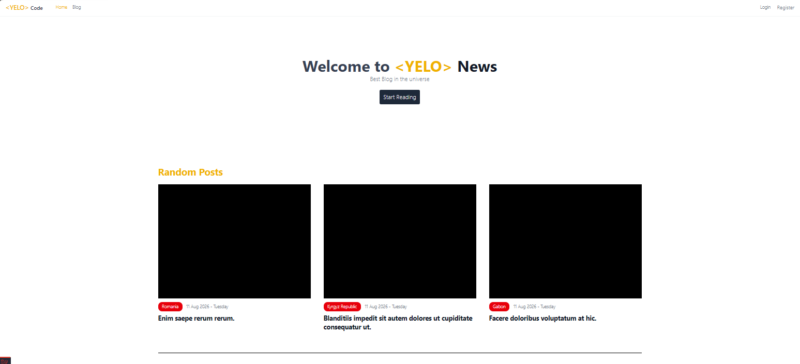
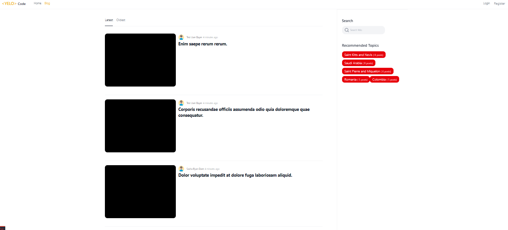
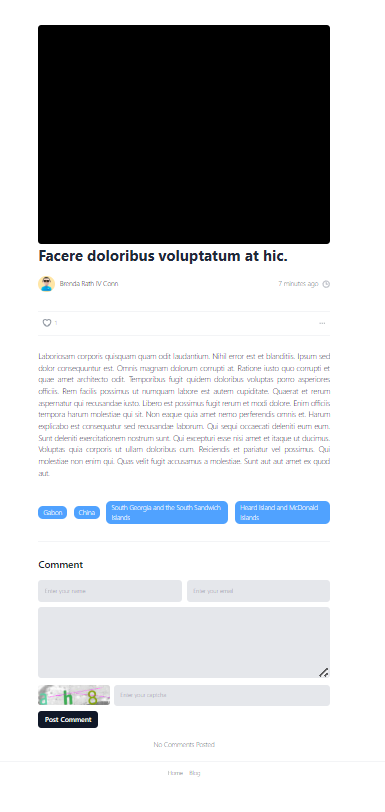
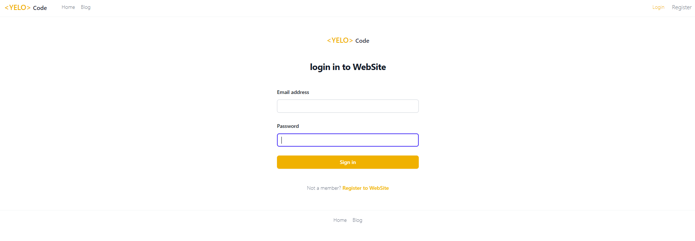
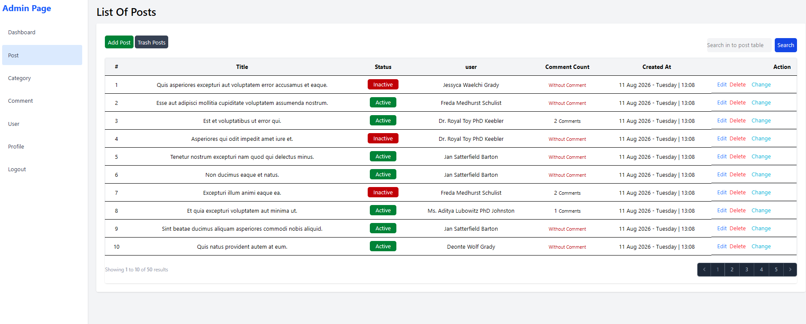
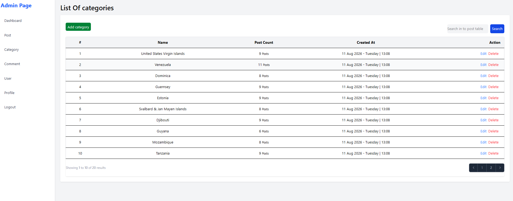
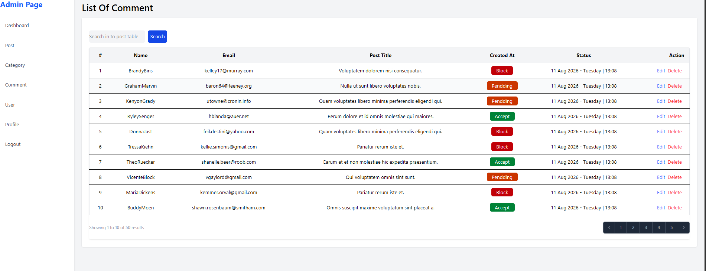
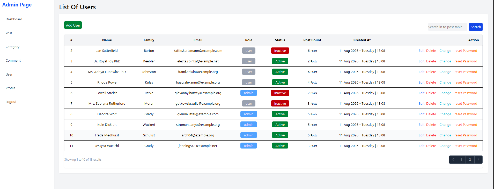
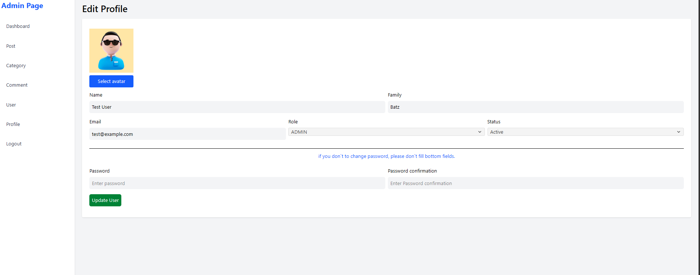

# Laravel Blog & Admin Panel

A full-featured blog application built with **Laravel**, **MySQL**, **HTML**, **CSS**, and **REST API**.

This project includes a public blog, authentication and authorization, a complete admin panel, CRUD operations, API resources, background jobs, email services, and real-time features.

---

## 📸 Screenshots

### 🌐 Useer Panel

#### Home


#### Blog


#### Single Post


#### Login


#### Register


---

### 🧑‍💻 Admin Panel

#### Posts


#### Categories


#### Comments


#### Users


#### Profile


---

## ✨ Features

| Feature | Description |
|---|---|
| 🔐 Authentication & Authorization | User authentication with authorization and access control |
| 🛡️ Policies & Gates | Secure access to protected resources and actions |
| 📝 Blog Management | Full CRUD operations for blog posts |
| 📂 Category Management | Full CRUD operations for categories |
| 💬 Comment Management | Manage and moderate comments |
| 👤 User Management | Admin management of registered users |
| 🔄 Status Management | Change and manage entity statuses |
| 🗑️ Soft Deletes | Recoverable deletion for supported entities |
| 🔎 Search | Search functionality for application data |
| 📄 Pagination | Paginated lists for better performance and usability |
| 🖼️ Image Processing | Image upload and editing functionality |
| 📧 Email Notifications | Email sending and notification functionality |
| ⚙️ Queues & Jobs | Background processing for emails and other tasks |
| 🔑 Password Management | Password change and random password generation via email |
| 👤 User Profile | Profile and avatar management |
| 🧩 REST API | API built with Laravel Resources and Collections |
| ⚡ Real-Time Features | Real-time functionality implemented in the application |
| 🛡️ CAPTCHA | CAPTCHA protection for selected forms |

---

## 🛠️ Technologies

- **Laravel**
- **PHP**
- **MySQL**
- **HTML5**
- **CSS3**
- **REST API**
- **Laravel API Resources & Collections**
- **Queues & Jobs**
- **Authentication & Authorization**

---

## 🔌 API

The project provides REST API endpoints using **Laravel API Resources and Collections**.

API responses are structured through dedicated resources and collections and handled by their corresponding controllers.

---

## 🧑‍💻 Admin Panel

The admin panel provides management functionality for:

- Posts
- Categories
- Comments
- Users
- Profiles

Each major entity supports CRUD operations along with:

- Search
- Status management
- Soft deletes
- Pagination

---

## ⚡ Background Processing

The application uses **Jobs and Queues** to handle background tasks such as email processing and other time-consuming operations.

This helps keep the application responsive by moving heavy tasks to the background.

---

## 🔐 Security

The project uses several Laravel security features, including:

- Authentication
- Authorization
- Policies
- Gates
- CAPTCHA
- Protected admin routes

---

## 👤 User Profile

Users can manage their personal profile, including:

- Profile information
- Profile image
- Password
- Password recovery

A randomly generated password can also be sent to the user's email when required.

---

## ⚙️ Installation

Clone the repository:

```bash
git clone https://github.com/moradi-x/project-laravel.git
cd project-laravel
